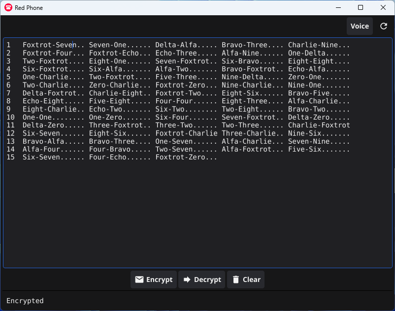
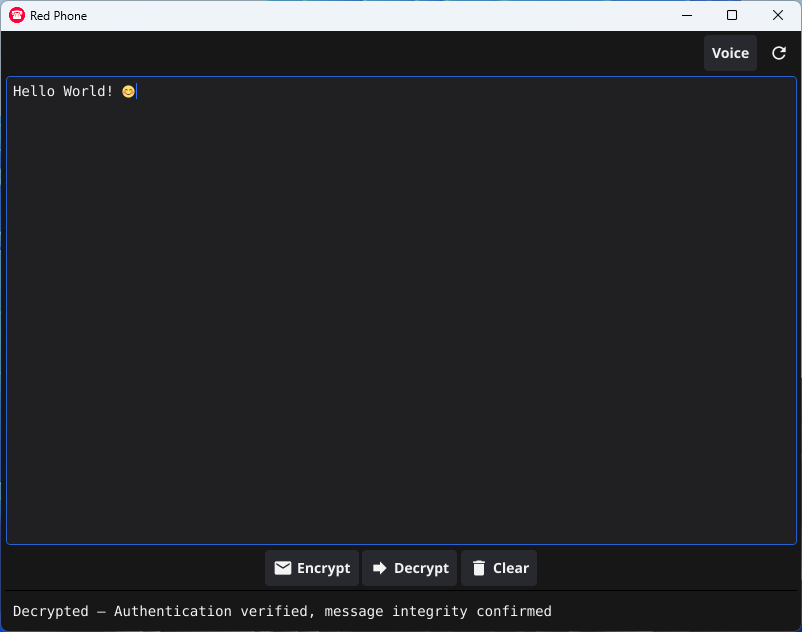

# Red Phone
📞 Red Phone is a minimalist, secure encryption tool designed for voice and SMS transmission.  

It uses authenticated encryption (ChaCha20-Poly1305) with key derivation via Argon2id. 

