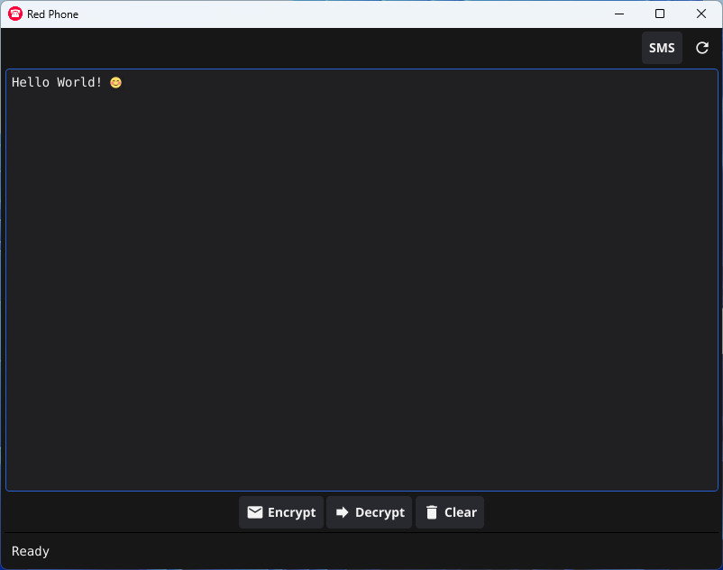

# Red Phone
📞 Red Phone is a minimalist, secure encryption tool designed for voice and SMS transmission.  

It uses authenticated encryption (ChaCha20-Poly1305) with key derivation via Argon2id. 




## 1. Password Protection  
Passwords are immediately secured in memguard.LockedBuffer  

Automatic destruction when out of scope  

Secure wiping after use  

## 2. Encryption Key Protection  
Derived keys are stored in locked memory  

Protected against memory dumping attacks  

## 3. Plaintext Protection  
Both input and output plaintexts are secured  

Temporary copies are minimized  

## 4. Secure Clipboard Clearing  
Overwrites with random data before clearing  

Prevents clipboard recovery attacks  

## 5. Comprehensive Memory Management  
memguard.CatchInterrupt() for cleanup on exit  

memguard.Purge() on application close  

Proper defer patterns for resource cleanup  

## 6. Enhanced Status Messages  
Clear feedback about security operations    

Authentication and integrity confirmation  

## --
If you like Red Phone, as much as I do,  
consider a small donation in crypto currencies.

```  
BTC: bc1qhgek8p5qcwz7r6502y8tvenkpsw9w5yafhatxk 
Nym: n1yql04xjhmlhfkjsk8x8g7fynm27xzvnk23wfys  
XMR: 45TJx8ZHngM4GuNfYxRw7R7vRyFgfMVp862JqycMrPmyfTfJAYcQGEzT27wL1z5RG1b5XfRPJk97KeZr1svK8qES2z1uZrS
```
Or if you prefer, <a href="https://www.buymeacoffee.com/Ch1ffr3punk" target="_blank"></a>

Red Phone is dedicated to ALice and Bob.
